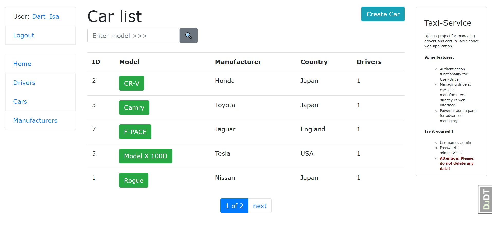

# Taxi-Service

Django project for managing drivers and cars in Taxi Service web-application.

## Check it out!

[Taxi-service project deploy to Heroku]()

## Installation

Python 3 must be already installed

```shell
git clone https://github.com/Aleksei-Isaev/Taxi-Service-Web-Application.git
python -m venv venv
source venv/bin/activate - on macOS (venv\Scripts\activate - on Windows)
pip install -r requirements.txt
python manage.py migrate
python manage.py runserver
```

## Features

* Authentication functionality for User/Driver
* Managing drivers, cars and manufacturers directly from website interface
* Powerful admin panel for advanced managing

## Access

* Username: admin
* Password: admin12345
* ##### Warning: Please, do not delete any user!

## Demo


